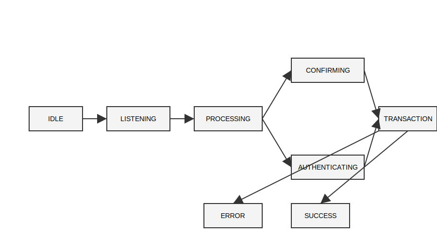

# T-Bank Audio UX
### Zero-UI Banking Interface

Control your finances without looking at the screen.

T-Bot is an experimental **voice-first banking interface** designed for situations where screens are inconvenient or unsafe.

Walking with groceries.  
Driving in traffic.  
Running through the city.

Your phone stays in your pocket.  
Your finances stay in your ears.

---

# The Problem

Modern banking apps depend entirely on visual interfaces.

But in many real situations:

- hands are occupied
- eyes are focused elsewhere
- unlocking and navigating an app becomes slow and unsafe

Financial interaction becomes **friction**.

---

# The Shift: Zero-UI

By 2026, interfaces increasingly move beyond screens.

Voice, sound and context-aware systems allow interaction without visual attention.

This project explores a **Zero-UI banking paradigm**.

---

# The Solution: T-Bot

T-Bot is an invisible financial assistant that lives in your headphones.

It combines:

- voice interaction
- sonic feedback
- contextual privacy
- biometric security

All financial actions can be performed using **voice + sound + haptics**.

---

# Core Idea

Sound replaces the screen.

Instead of icons and buttons, the interface uses a **language of earcons** — functional sound signals.

Examples:

| Action | Sound |
|------|------|
Listening | rising tone |
Processing | low pulse |
Success | major chord |
Error | descending tone |

These sounds form an **auditory interface vocabulary**.

---

# Smart Silence

Traditional voice assistants often feel noisy.

T-Bot uses **Smart Silence Protocol**.

The system dynamically adapts between four modes:

| Mode | Context |
|-----|------|
Silent | meetings / do-not-disturb |
Micro | public environments |
Conversational | quiet spaces |
Ambient | long operations |

The goal is simple:

The interface should always feel **alive but unobtrusive**.

---

# Security

Removing the screen requires stronger security.

T-Bot uses:

- Voice biometric identification
- Anti-spoofing protection
- Whisper confirmation for critical actions

Large transfers require additional confirmation signals.

---

# Example Scenario

User walking with grocery bags.

Command:

"Переведи 350 рублей Маше"

System flow:

1. Listening tone
2. Intent recognition
3. Confirmation
4. Voice biometric check
5. Transaction
6. Success chord

Total interaction time:

≈ 2 seconds.
# Demo Interaction

User: "Transfer 500 rubles to Masha"

T-Bot:
🎧 listening tone  
🎧 processing pulse  
🎧 success chord

Transaction completed in 2 seconds.
---

# Sound as Data

Financial information can also be represented as sound.

Example:

Balance query in privacy mode.

Instead of speaking numbers, the system uses **sound density**.

Low balance → light texture  
Medium balance → fuller sound  
High balance → rich harmonic layer

This allows private feedback even in crowded environments.

---

# System Architecture

Interaction states:

IDLE → LISTENING → PROCESSING → CONFIRMATION → AUTH → TRANSACTION → RESULT

---

# Why This Matters

Audio UX opens new opportunities for financial interaction.

Benefits:

- safer interactions while moving
- accessibility for visually impaired users
- faster micro-transactions
- deeper emotional connection with the brand

---

# Project Structure
